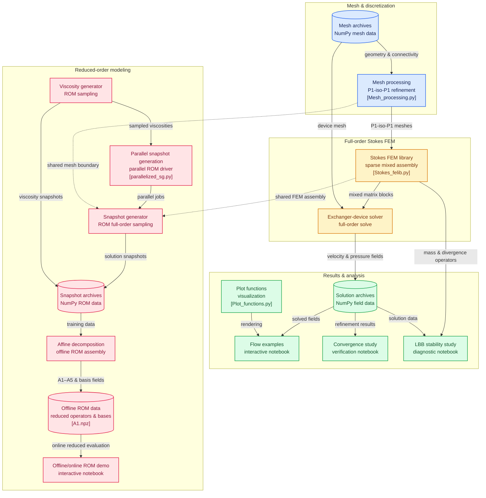

# Finite Element Method for the Incompressible Stokes Equations

This project implements a two-dimensional finite element solver for the incompressible Stokes equations using the **P1-iso-P1 mixed finite element method** and then explores Reduced Order Modelling as a way to compress the amount of time needed to solve the parametrized problem.


---

### `Stokes_Solver` (Saddle-Point FEM Solver)

$$-\nu\Delta\mathbf{u} + \nabla p = 0, \qquad \nabla\cdot\mathbf{u} = 0$$

This solver handles steady-state incompressible Stokes flow under a spatially varying viscosity $\nu(\mathbf{x})$, discretized on a **P1-iso-P1** macro-element pairing (velocity on a fine mesh, pressure on a coarse mesh) that satisfies the LBB inf-sup condition without resorting to higher-order elements. It assembles the global saddle-point operator $K = \begin{bmatrix} A & 0 & B_x^T \\ 0 & A & B_y^T \\ B_x & B_y & 0 \end{bmatrix}$ and solves it directly via sparse LU factorization, enforcing Dirichlet boundary conditions through row substitution and regularizing the singular pressure null-space by pinning a single reference degree of freedom.

---

### `Affine_Viscosity_Decomposition` (Parametrized Assembly)

$$\nu(\mathbf{x};\boldsymbol{\mu}) = \sum_{k=1}^{5} \mu_k\,\psi_k(\mathbf{x}), \qquad A(\boldsymbol{\mu}) = \sum_{k=1}^{5} \mu_k A_k$$

Because viscosity enters the weak form linearly, the stiffness operator inherits an affine dependence on the five-dimensional parameter vector $\boldsymbol{\mu}\in[10,200]^5$, which controls viscosity values at five Shepard-interpolated control points. This lets five parameter-independent matrices $A_1,\dots,A_5$ be assembled once and reused for any $\boldsymbol{\mu}$ as a cheap scalar-weighted sum, entirely avoiding per-query reassembly of the global operator.

---

### `POD_ROM` (Reduced-Order Model)

$$\mathcal{M} = \{(\mathbf{u}_h(\boldsymbol{\mu}), p_h(\boldsymbol{\mu})) : \boldsymbol{\mu}\in\mathcal{P}\}, \qquad \mathbf{t} = X_u^{-1}B_h^T\mathbf{p}$$

Exploiting the fact that the solution manifold $\mathcal{M}$ has low intrinsic dimension despite living in a high-dimensional discrete space, the framework builds a reduced basis via Proper Orthogonal Decomposition on 100 Latin-Hypercube-sampled full-order snapshots, enriching the velocity space with supremizer modes $\mathbf{t}$ to preserve inf-sup stability at the reduced level. The offline stage precomputes all reduced operators once; the online stage then solves only a small Galerkin system per new $\boldsymbol{\mu}$, at cost independent of the underlying mesh resolution.


## Features

- Finite Element Method for incompressible Stokes flow
- P1-iso-P1 mixed discretization
- Sparse matrix assembly
- Velocity stiffness matrix construction
- Pressure-velocity coupling operators
- Saddle-point system assembly
- Dirichlet and Neumann boundary conditions
- Pressure null-space handling
- Discrete LBB stability analysis
- Python implementation using NumPy and SciPy
- Reduced Order Model
- Affine decomposition for the velocity operators
- Parametrized viscosity fields

---

## Repository Structure



```text
.
├── Demonstrations
│   ├── Flow_examples.ipynb
│   ├── ROM_OfflineIOnline.ipynb
│   ├── Reduced_Order_Model.ipynb
│   ├── Stokes_Convergence.ipynb
│   ├── Stokes_Stability.ipynb
│   ├── Visuals.ipynb
│   └── stokes_equations.ipynb
├── Drafts
│   ├── Notes.txt
│   ├── ROM_&_FEM_PAPER.pdf
│   ├── Stokes_draft.py
│   └── paper_draft.txt
├── LICENSE
├── Meshes
│   ├── Backstep_mesh_data.npz
│   ├── Comb_mesh_data.npz
│   ├── Hexagonal_pipe_system_mesh_data.npz
│   ├── LBB_test_mesh_data.npz
│   ├── Winding_pipe_fixed_mesh_data.npz
│   ├── Winding_pipe_mesh_data.npz
│   ├── exchanger_device_altered_mesh_data.npz
│   ├── exchanger_device_mesh_data.npz
│   └── honeycomb_wide_data.npz
├── NOTICE
├── Outputs
│   ├── Combined_Solution.png
│   ├── Flow.jpeg
│   ├── InitialvsRefined_mesh.jpeg
│   ├── Jacobian_tri_transform.svg
│   ├── LBB_stability_P1isoP1.png
│   ├── LHS_downprojected.png
│   ├── Mesh_Refinement.jpeg
│   ├── P1-iso-P1.svg
│   ├── POD_Energy_Spectrum_pressure.png
│   ├── POD_Energy_Spectrum_supremizer.png
│   ├── POD_Energy_Spectrum_velocity (homogeneous).png
│   ├── Pressure_Tricontourf.jpeg
│   ├── Solution_Streamlines.jpeg
│   ├── Solution_Streamlines.png
│   ├── Stokes_A_matrix.jpeg
│   ├── Stokes_B_x_matrix.jpeg
│   ├── Stokes_K_matrix_labeled.jpeg
│   ├── Stokes_K_matrix_labeled_POD.png
│   ├── Stokes_Mass Matrix (Pressure)_matrix.jpeg
│   ├── Stokes_Mass Matrix (Velocity)_matrix.jpeg
│   ├── Viscosity.png
│   ├── Viscosity_Basis_Functions.png
│   └── convergence_plot.png
├── README.md
├── Reduced_Order_Modeling
│   ├── No_Online_Offline_phase
│   │   ├── Data
│   │   │   ├── stokes_solution_snapshots.npz
│   │   │   └── viscosity_snapshots.npz
│   │   ├── parallelized_sg.py
│   │   ├── snapshot_generator.py
│   │   └── viscosity_generator.py
│   └── Online_Offline_phase
│       ├── Affine_Decomposition.py
│       └── Data
│           ├── A1.npz
│           ├── A2.npz
│           ├── A3.npz
│           ├── A4.npz
│           ├── A5.npz
│           └── basis_fields.npz
├── Solutions
│   ├── Backstep.npz
│   ├── Comb.npz
│   ├── Convergence_Step_0.npz
│   ├── Convergence_Step_1.npz
│   ├── Convergence_Step_2.npz
│   ├── Convergence_Step_3.npz
│   ├── Convergence_Step_4.npz
│   ├── Convergence_Step_5.npz
│   ├── Convergence_Step_6.npz
│   ├── Exchanger_device.npz
│   ├── Exchanger_device_with_varying_viscosity.npz
│   ├── Reference_Solution.npz
│   ├── Winding_pipe.npz
│   └── Winding_pipe_solution.npz
├── Solvers
│   └── Exchanger_Device.py
│   
└── Utilities
    ├── Mesh_processing.py
    ├── Plot_functions.py
    └── Stokes_felib.py
```

---

## Author

**Oleksandr Samoliuk**  
Johannes Kepler University Linz  
Summer Semester 2026

(Huge thanks to **Stefan Takacs** for providing guidence and support)