```mermaid
flowchart TB

%% ============================================================
%% SNAPSHOT ROM
%% ============================================================

subgraph group_rom_snapshot["Snapshot ROM"]
  direction TB

  node_parallel_snapshots["Parallel snapshot runner<br/>parallel workflow<br/>[parallelized_sg.py]"]
  node_viscosity_generator["Viscosity sampler<br/>ROM generator"]
  node_snapshot_generator["Full-order snapshots<br/>ROM generator"]
  node_snapshot_data[("Snapshot data<br/>ROM archives")]

  node_parallel_snapshots -->|"parallelizes"| node_snapshot_generator
  node_viscosity_generator -->|"parameter samples"| node_snapshot_generator
  node_snapshot_generator -->|"writes snapshots"| node_snapshot_data
end


%% ============================================================
%% FULL-ORDER STOKES SOLVER
%% ============================================================

subgraph group_full["Full-order Stokes solver"]
  direction TB

  node_meshes[("Pre-generated meshes<br/>mesh archives")]
  node_mesh_processing["Mesh processing<br/>FEM mesh layer<br/>[Mesh_processing.py]"]
  node_stokes_fem["Stokes FEM assembly<br/>FEM library<br/>[Stokes_felib.py]"]
  node_exchanger_solver["Exchanger solver<br/>Python executable"]
  node_solutions[("Solution archives<br/>NumPy results")]

  node_meshes -->|"loads"| node_mesh_processing
  node_mesh_processing -->|"coarse and refined meshes"| node_stokes_fem
  node_stokes_fem -->|"sparse Stokes blocks"| node_exchanger_solver
  node_exchanger_solver -->|"writes fields"| node_solutions
end


%% ============================================================
%% ANALYSIS WORKFLOWS
%% ============================================================

subgraph group_analysis["Analysis workflows"]
  direction TB

  node_plotting["Field plotting<br/>visualization library<br/>[Plot_functions.py]"]
  node_flow_examples["Flow examples<br/>interactive notebook"]
  node_convergence["Convergence analysis<br/>interactive notebook"]
  node_stability["LBB stability analysis<br/>interactive notebook"]

  node_plotting -->|"renders fields"| node_flow_examples
  node_plotting -->|"renders results"| node_convergence
end


%% ============================================================
%% OFFLINE / ONLINE ROM
%% ============================================================

subgraph group_rom_affine["Offline/online ROM"]
  direction TB

  node_affine_decomposition["Affine decomposition<br/>ROM offline stage"]
  node_affine_data[("Affine operators and basis<br/>ROM archives")]
  node_rom_notebook["ROM offline/online workflow<br/>interactive notebook"]

  node_affine_decomposition -->|"writes A1–A5 and basis"| node_affine_data
  node_affine_data -->|"online evaluation inputs"| node_rom_notebook
end


%% ============================================================
%% MAIN VERTICAL ARCHITECTURE
%% These invisible links force the major sections downward.
%% ============================================================

node_snapshot_data ~~~ node_meshes
node_solutions ~~~ node_plotting
node_plotting ~~~ node_affine_decomposition


%% ============================================================
%% CROSS-SYSTEM DATA FLOW
%% ============================================================

node_snapshot_generator -->|"uses full-order assembly"| node_stokes_fem

node_mesh_processing -->|"mesh input"| node_affine_decomposition
node_stokes_fem -->|"operator construction"| node_affine_decomposition

node_stokes_fem -->|"mass and divergence operators"| node_stability
node_solutions -->|"solution data"| node_stability
node_solutions -->|"visualizes"| node_flow_examples
node_solutions -->|"compares refinement results"| node_convergence


%% ============================================================
%% LINKS
%% ============================================================

click node_meshes "https://github.com/japanese-maple/finite-element-method-fem-rom-reduced-order-modeling/blob/main/Meshes/exchanger_device_mesh_data.npz"
click node_mesh_processing "https://github.com/japanese-maple/finite-element-method-fem-rom-reduced-order-modeling/blob/main/Utilities/Mesh_processing.py"
click node_stokes_fem "https://github.com/japanese-maple/finite-element-method-fem-rom-reduced-order-modeling/blob/main/Utilities/Stokes_felib.py"
click node_exchanger_solver "https://github.com/japanese-maple/finite-element-method-fem-rom-reduced-order-modeling/blob/main/Solvers/Exchanger_Device.py"
click node_solutions "https://github.com/japanese-maple/finite-element-method-fem-rom-reduced-order-modeling/blob/main/Solutions/Exchanger_device.npz"

click node_plotting "https://github.com/japanese-maple/finite-element-method-fem-rom-reduced-order-modeling/blob/main/Utilities/Plot_functions.py"
click node_flow_examples "https://github.com/japanese-maple/finite-element-method-fem-rom-reduced-order-modeling/blob/main/Demonstrations/Flow_examples.ipynb"
click node_convergence "https://github.com/japanese-maple/finite-element-method-fem-rom-reduced-order-modeling/blob/main/Demonstrations/Stokes_Convergence.ipynb"
click node_stability "https://github.com/japanese-maple/finite-element-method-fem-rom-reduced-order-modeling/blob/main/Demonstrations/Stokes_Stability.ipynb"

click node_viscosity_generator "https://github.com/japanese-maple/finite-element-method-fem-rom-reduced-order-modeling/blob/main/Reduced_Order_Modeling/No_Online_Offline_phase/viscosity_generator.py"
click node_snapshot_generator "https://github.com/japanese-maple/finite-element-method-fem-rom-reduced-order-modeling/blob/main/Reduced_Order_Modeling/No_Online_Offline_phase/snapshot_generator.py"
click node_parallel_snapshots "https://github.com/japanese-maple/finite-element-method-fem-rom-reduced-order-modeling/blob/main/Reduced_Order_Modeling/No_Online_Offline_phase/parallelized_sg.py"

click node_affine_decomposition "https://github.com/japanese-maple/finite-element-method-fem-rom-reduced-order-modeling/blob/main/Reduced_Order_Modeling/Online_Offline_phase/Affine_Decomposition.py"
click node_rom_notebook "https://github.com/japanese-maple/finite-element-method-fem-rom-reduced-order-modeling/blob/main/Demonstrations/ROM_OfflineIOnline.ipynb"


%% ============================================================
%% STYLING
%% ============================================================

classDef toneBlue fill:#dbeafe,stroke:#2563eb,stroke-width:1.5px,color:#172554
classDef toneAmber fill:#fef3c7,stroke:#d97706,stroke-width:1.5px,color:#78350f
classDef toneMint fill:#dcfce7,stroke:#16a34a,stroke-width:1.5px,color:#14532d
classDef toneRose fill:#ffe4e6,stroke:#e11d48,stroke-width:1.5px,color:#881337

class node_meshes,node_mesh_processing,node_stokes_fem,node_exchanger_solver,node_solutions toneBlue
class node_plotting,node_flow_examples,node_convergence,node_stability toneAmber
class node_viscosity_generator,node_snapshot_generator,node_parallel_snapshots,node_snapshot_data toneMint
class node_affine_decomposition,node_affine_data,node_rom_notebook toneRose
```

# Finite Element Method for the Incompressible Stokes Equations

This project implements a two-dimensional finite element solver for the incompressible Stokes equations using the **P1-iso-P1 mixed finite element method**.

The implementation covers the complete workflow from the continuous PDE formulation to sparse matrix assembly, saddle-point system construction, and verification of the Ladyzhenskaya-Babuška-Brezzi (LBB) stability condition.

---

## Governing Equations

The steady incompressible Stokes equations are

```math
-\nu \Delta \mathbf{u} + \nabla p = \mathbf{0}
```

```math
\nabla \cdot \mathbf{u} = 0
```

where:

- $\mathbf{u}$ is the velocity field
- $p$ is the pressure field
- $\nu$ is the kinematic viscosity

These equations model low-Reynolds-number flows where viscous forces dominate inertial effects.

## Weak Formulation

Let

```math
u = \tilde u - r_g,
```

where $r_g$ is a lifting function satisfying the non-homogeneous Dirichlet boundary conditions.

The weak formulation reads:

```math
\int_{\Omega} \nu \nabla u : \nabla v \, d\Omega
-
\int_{\Omega} p \, (\nabla \cdot v)\, d\Omega
=
\int_{\Gamma_N} h \cdot v \, d\Gamma
-
\int_{\Omega} \nu \nabla r_g : \nabla v \, d\Omega,
\qquad \forall v \in X.
```

```math
-\int_{\Omega} q \, (\nabla \cdot u)\, d\Omega
=
\int_{\Omega} q \, (\nabla \cdot r_g)\, d\Omega,
\qquad \forall q \in Q.
```

where

- $u$ is the velocity field,
- $p$ is the pressure,
- $u$ is the kinematic viscosity,
- $h$ denotes Neumann boundary data,
- $r_g$ is the lifting function associated with the Dirichlet boundary conditions.

---

## P1-iso-P1 Discretization

The solver uses the classical **P1-iso-P1 element pair**:

- Velocity is discretized on a uniformly refined mesh
- Pressure is discretized on the original coarse mesh
- Both fields use continuous piecewise linear basis functions

This macro-element construction satisfies the discrete LBB condition while retaining the simplicity and efficiency of linear finite elements.

---

## Matrix Assembly

### Velocity Stiffness Matrix

```math
A_{ij}
=
\int_\Omega
\nu
\nabla\phi_i\cdot\nabla\phi_j
\, d\Omega
```

### Pressure Coupling Matrices

```math
(B_x)_{ij}
=
-\int_\Omega
\psi_j
\frac{\partial\phi_i}{\partial x}
\, d\Omega
```

```math
(B_y)_{ij}
=
-\int_\Omega
\psi_j
\frac{\partial\phi_i}{\partial y}
\, d\Omega
```

---

## Global Saddle-Point System

After assembly, the Stokes problem becomes

```math
\begin{bmatrix}
A & 0 & B_x^T \\
0 & A & B_y^T \\
B_x & B_y & 0
\end{bmatrix}
\begin{bmatrix}
u_x \\
u_y \\
p
\end{bmatrix}
=
\begin{bmatrix}
F_x \\
F_y \\
0
\end{bmatrix}
```

This system couples the momentum equations with the incompressibility constraint.

---

## LBB Stability Verification

The stability of the mixed discretization is verified through the discrete inf-sup condition

```math
\beta
=
\sqrt{
\lambda_{\min}
\left(
M_p^{-1}
B
M_v^{-1}
B^T
\right)
}
```

A strictly positive value of $\beta$ confirms stability of the chosen velocity-pressure pair.

---

## Features

- Finite Element Method for incompressible Stokes flow
- P1-iso-P1 mixed discretization
- Sparse matrix assembly
- Velocity stiffness matrix construction
- Pressure-velocity coupling operators
- Saddle-point system assembly
- Dirichlet and Neumann boundary conditions
- Pressure null-space handling
- Discrete LBB stability analysis
- Python implementation using NumPy and SciPy

---

## Repository Structure

```text
.
├── Demonstrations
│   ├── Flow_examples.ipynb
│   ├── Stokes_Convergence.ipynb
│   ├── Stokes_Stability.ipynb
│   ├── Visuals.ipynb
│   └── stokes_equations.ipynb
├── Drafts
│   ├── Notes.txt
│   ├── Stokes_draft.py
│   └── paper_draft.txt
├── Meshes
│   ├── Backstep_mesh_data.npz
│   ├── Comb_mesh_data.npz
│   ├── Hexagonal_pipe_system_mesh_data.npz
│   ├── LBB_test_mesh_data.npz
│   ├── Winding_pipe_fixed_mesh_data.npz
│   ├── Winding_pipe_mesh_data.npz
│   ├── exchanger_device_altered_mesh_data.npz
│   ├── exchanger_device_mesh_data.npz
│   └── honeycomb_wide_data.npz
├── Outputs
│   ├── Flow.jpeg
│   ├── InitialvsRefined_mesh.jpeg
│   ├── Jacobian_tri_transform.svg
│   ├── Mesh_Refinement.jpeg
│   ├── P1-iso-P1.svg
│   ├── Pressure_Tricontourf.jpeg
│   ├── Solution_Streamlines.jpeg
│   ├── Stokes_A_matrix.jpeg
│   ├── Stokes_B_x_matrix.jpeg
│   ├── Stokes_K_matrix_labeled.jpeg
│   ├── Stokes_Mass Matrix (Pressure)_matrix.jpeg
│   └── Stokes_Mass Matrix (Velocity)_matrix.jpeg
├── README.md
├── Solutions
│   ├── Backstep.npz
│   ├── Comb.npz
│   ├── Convergence_Step_0.npz
│   ├── Convergence_Step_1.npz
│   ├── Convergence_Step_2.npz
│   ├── Convergence_Step_3.npz
│   ├── Exchanger_device.npz
│   ├── Reference_Solution.npz
│   ├── Winding_pipe.npz
│   └── Winding_pipe_solution.npz
├── Solvers
│   └── Exchanger_Device.py
│   
└── Utilities
    ├── Mesh_processing.py
    └── Stokes_felib.py
```



---

## Author

**Oleksandr Samoliuk**  
Johannes Kepler University Linz  
Summer Semester 2026

(Huge thanks to **Stefan Takacs** for providing guidence and support)